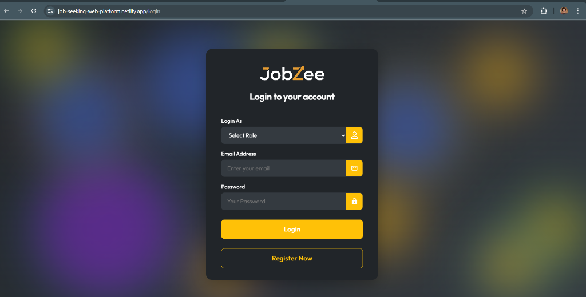

# Job Seeking Web Application

A comprehensive full-stack job seeking platform built with the **MERN Stack** (MongoDB, Express.js, React, Node.js). This application connects employers with job seekers, facilitating a seamless recruitment process.

## 🚀 Live Demo

- https://job-seeking-web-platform.netlify.app/

## ✨ Features

### 👨‍💼 For Employers

- **Registration & Authentication:** Secure signup and login for employer accounts.
- **Post Jobs:** Create detailed job postings with categories, descriptions, locations, and salary ranges.
- **Manage Jobs:** View, edit, and delete posted jobs.
- **View Applications:** Access and review applications submitted by job seekers, including resumes.

### 👨‍💻 For Job Seekers

- **User Accounts:** Easy registration and login for job seekers.
- **Browse Jobs:** View all available job listings with real-time updates.
- **Search & Filter:** Find jobs by category, location, or keywords.
- **Apply for Jobs:** Submit applications with cover letters and resume uploads.
- **My Applications:** Track the status of submitted applications.

## 🛠️ Technology Stack

### Frontend

- **React.js:** Component-based UI library.
- **Vite:** Next-generation frontend tooling for fast builds.
- **React Bootstrap & Vanilla CSS:** For responsive and modern styling.
- **Context API:** For state management.
- **Axios:** For making HTTP requests.

### Backend

- **Node.js & Express.js:** Robust server-side framework.
- **MongoDB & Mongoose:** NoSQL database for flexible data storage.
- **JWT (JSON Web Tokens):** For secure user authentication.
- **Bcrypt:** For password hashing.
- **Cloudinary:** For efficient image and resume storage.
- **Cookie-Parser:** For handling authentication cookies.

## ⚙️ Installation & Local Setup

Follow these steps to run the project locally.

### Prerequisites

- Node.js installed
- MongoDB installed or a MongoDB Atlas connection string

### 1. Clone the Repository

```bash
git clone https://github.com/gnutulapati/Job-Seeking-Web-Application.git
cd job-seeking-web-application
```

### 2. Backend Setup

Navigate to the backend directory and install dependencies:

```bash
cd backend
npm install
```

Create a `config/config.env` file in the `backend` directory with the following variables:

```env
PORT=4000
CLOUDINARY_CLIENT_NAME=your_cloud_name
CLOUDINARY_CLIENT_API=your_api_key
CLOUDINARY_CLIENT_SECRET=your_api_secret
FRONTEND_URL=http://localhost:5173
MONGO_URI=your_mongodb_connection_string
JWT_SECRET_KEY=your_jwt_secret
JWT_EXPIRES=7d
COOKIE_EXPIRE=5
```

Start the backend server:

```bash
npm run dev
```

### 3. Frontend Setup

Open a new terminal, navigate to the frontend directory, and install dependencies:

```bash
cd ../frontend
npm install
```

Create a `.env` file in the `frontend` directory with the following variable:

```env
VITE_API_URL=http://localhost:4000
```

Start the frontend development server:

```bash
npm run dev
```

## 📡 API Endpoints

The backend exposes the following RESTful API endpoints:

- **User Routes** (`/api/v1/user`)

  - `POST /register` - Register a new user
  - `POST /login` - Login user
  - `GET /logout` - Logout user
  - `GET /getuser` - Get current user details

- **Job Routes** (`/api/v1/job`)

  - `GET /getall` - Get all jobs
  - `POST /post` - Post a new job (Employer only)
  - `GET /getmyjobs` - Get jobs posted by logged-in employer
  - `PUT /update/:id` - Update a job
  - `DELETE /delete/:id` - Delete a job
  - `GET /:id` - Get single job details

- **Application Routes** (`/api/v1/application`)
  - `POST /post` - Submit an application (Job Seeker only)
  - `GET /employer/getall` - Get all applications for an employer
  - `GET /jobseeker/getall` - Get all applications for a job seeker
  - `DELETE /delete/:id` - Delete an application

## 📸 Screenshots





## 👤 Author

**Gourav Nutulapati**

- LinkedIn: https://www.linkedin.com/in/gourav-nutulapati-5433342a4/
- GitHub: https://github.com/gnutulapati
